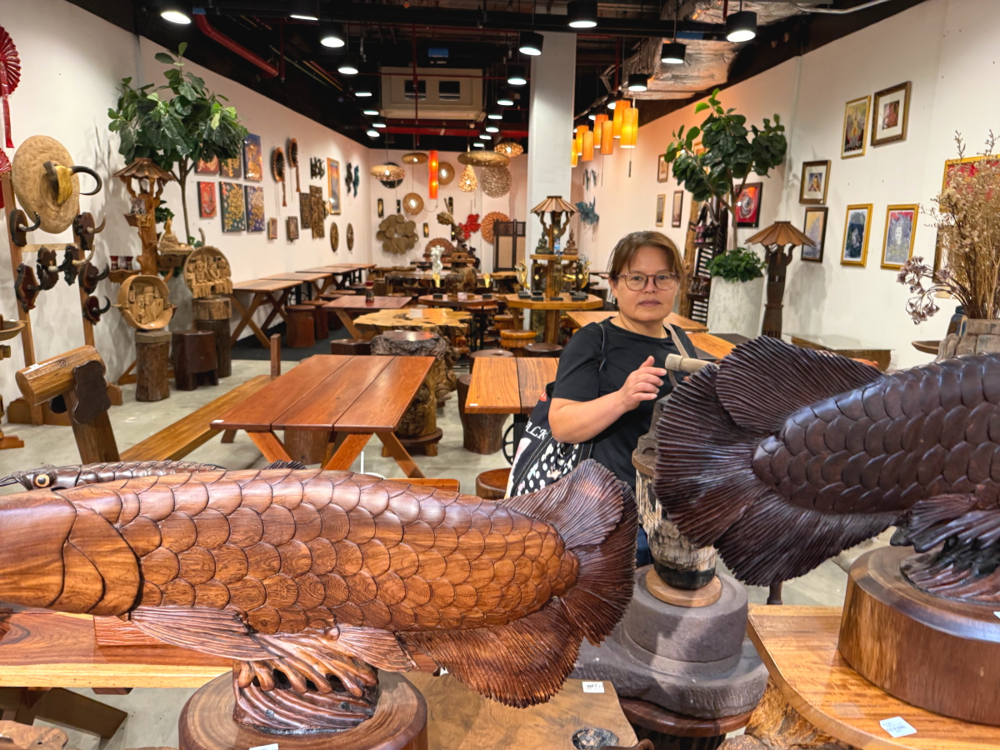

# 20250926_maechan

<html lang="ja" data-loaded="false" data-scrolled="false" data-spmenu="closed">
<head>

<meta charset="UTF-8">
<meta http-equiv="Content-Type" content="text/html; charset=UTF-8">
<meta http-equiv="X-UA-Compatible" content="IE=EmulateIE10" />
<meta http-equiv="X-UA-Compatible" content="IE=edge">

<meta name="viewport" content="width=device-width, initial-scale=1.0">

<!--ここから上はお決まりの定型文です-->

<!--ここからが表現の書式などを決めるcssという部分-->

<link href="https://cdnjs.cloudflare.com/ajax/libs/lightbox2/2.7.1/css/lightbox.css" rel="stylesheet">

</head>

<body>

モバイル端末をお使いの場合は、画面を横向きにすると
背景画像の横方向がご覧頂けます。

<!--ここ上は、ほぼそのまま使います！-->

<!--QRコードの挿入例-->

 アクセス用QRコード

<marquee direction="left" scrollamount="20" width="30%">(^_^)/~alis</marquee>

<!--流れ文字の挿入例-->
<h1><marquee behavior="left">!!! 2025/09/24-25、メーチャンの市役所から、王立大学のプールまで!!!</marquee></h1>

                          

<!--ここから下が、本体部分-->
    

 
<h2>24日、メーチャンの市役所でVISA用書類の入手</h2>

    
<h2>メーチャンのLotus`sで知り合いの尼さんたちに遭遇</h2>

<h2>写真撮ってたら、通りすがりの女性のお客さんがシャッター切ってくれました</h2>

    
<h2>雨の帰り道、荷台に乗るタイ人達</h2>

    
<h2>雨も上がって、雲の向こうに太陽</h2>

    
<h2>雨上がりのお花がしっとり</h2>

    
<h2>25日、朝から足元で猫ちゃんがまったり〜</h2>

    
<h2>親戚のコーヒーショップに寄ります</h2>

    
<h2>入り口のお花が見事</h2>

    
<h2>チェンライの市役所で妻のパスポートの更新</h2>

    
<h2>おうむの置き物が色鮮やか</h2>

    
<h2>TEA ＆ CAFEのイベント中</h2>

    
<h2>パン屋さんで朝食のパンを購入</h2>

    
<h2>電気屋さんで小型扇風機を物色</h2>

    
<h2>置き物屋さんの犬とウサギたち</h2>

    
<h2>DAISOで小物調達</h2>

    
<h2>タイのゾウさんは神格化されてます</h2>

    
<h2>かなりとぼけた顔の置き物</h2>

    
<h2>木彫りのお店は伝統を守って営業中とのこと</h2>

    
<h2>王室崇拝は当たり前</h2>

    
<h2>お昼はフードコート</h2>

    
<h2>イベントの舞台は盛り上がってます</h2>

    
<h2>帰り道、王立大学のプールに寄りました</h2>

    
<h2>公共トイレが工事中で、安全祈願の神棚</h2>

    
<h2>プールのお客さんは1人</h2>

    
<h2>屋外のアスレチックで軽く運動</h2>

    
<h2>構内を行き来する学生さん達のバイク 以下2枚↓、画像クリックで動画再生します</h2>

 

    
<h2>帰りに寄った雑貨屋さんの造花が鮮やか</h2>

    
<h2>Uターン区間で世間話するお母さん達</h2>

    
<h2>猫ちゃんは夕飯</h2>

         

<!--  
<h2>再掲【暑中お見舞い（ほたる）】LINEでご挨拶・動画で送る夏のグリーティングカード / ギターbgm/蛍の光・癒し動画</h2>

<iframe width="560" height="315" src="https://www.youtube.com/embed/Z4PKDOhRzfI?si=LaAJ8dA-1izGspEO" title="YouTube video player" frameborder="0" allow="accelerometer; autoplay; clipboard-write; encrypted-media; gyroscope; picture-in-picture; web-share" referrerpolicy="strict-origin-when-cross-origin" allowfullscreen></iframe>
    
   
-->   
    
    

  
<h2>今日のBGMは Tropical Deep House Relaxation 2025 🌞 Best Chill Vocal Summer Mix in 4K UHD for TV | XDeep Music</h2>

<iframe width="560" height="315" src="https://www.youtube.com/embed/-ur9s3-3pik?si=ck4I_WPNEy4Fl9D9" title="YouTube video player" frameborder="0" allow="accelerometer; autoplay; clipboard-write; encrypted-media; gyroscope; picture-in-picture; web-share" referrerpolicy="strict-origin-when-cross-origin" allowfullscreen></iframe>
    

    
  
<h2>8月17日にメタバースで披露されたまいてゃさんの新曲「Lonely game」</h2>

<iframe width="560" height="315" src="https://www.youtube.com/embed/HstFJ2_8oQA?si=QrYNv_EcIm7fALkV" title="YouTube video player" frameborder="0" allow="accelerometer; autoplay; clipboard-write; encrypted-media; gyroscope; picture-in-picture; web-share" referrerpolicy="strict-origin-when-cross-origin" allowfullscreen></iframe>
    

    
    

    
    
    <h3>「雪の中で輝くシンデレラ」by まいてゃ</h3>
<h2><a href="https://torokoid.github.io/20250219_chiangrai/maitiyaz.mp3" target="_blank">この文字クリックで再生します 下の再生ボタンでも同じ曲をループ再生します</a></h2>

    <audio controls loop>
        <source src="https://torokoid.github.io/20250219_chiangrai/maitiyaz.mp3" type="audio/mpeg">
        お使いのブラウザは audio タグをサポートしていません。
    </audio>
 
    
<!--
  
<h2>スティーブ・ジョブズの伝説の講義</h2> 
<iframe width="560" height="315" src="https://www.youtube.com/embed/XsRpvWHIVw0?si=f7IA0pv9iZWVk3VH" title="YouTube video player" frameborder="0" allow="accelerometer; autoplay; clipboard-write; encrypted-media; gyroscope; picture-in-picture; web-share" referrerpolicy="strict-origin-when-cross-origin" allowfullscreen></iframe>    
    
    
<h2>スティーブ・ジョブズ氏の講義の内容が「笑って死ぬ」by まいてゃ さんの歌の内容と大筋で同じに聞こえます 以下に再掲しますね</h2>

    
<h3>歌の後半部分しか撮れてませんが、2月16日のイベントで公開された「笑って死ぬ」 by まいてゃ 白ドレスはダンサーの玖遠さん、黒いドレスがまいてゃさん</h3>
<iframe width="560" height="315" src="https://www.youtube.com/embed/s4ZcbxAluMM?si=Xa32xo19UCNaWv0v" title="YouTube video player" frameborder="0" allow="accelerometer; autoplay; clipboard-write; encrypted-media; gyroscope; picture-in-picture; web-share" referrerpolicy="strict-origin-when-cross-origin" allowfullscreen></iframe> 
-->
    

    <h3>お気に入りの「笑って死ぬ」 by まいてゃさんも再々掲です</h3>
<h2><a href="https://torokoid.github.io/20250221_chiangrai/maitiya3.mp3" target="_blank">この文字クリックで再生します 下の再生ボタンで同じ曲をループ再生します</a></h2>

    <audio controls loop>
        <source src="https://torokoid.github.io/20250221_chiangrai/maitiya3.mp3" type="audio/mpeg">
        お使いのブラウザは audio タグをサポートしていません。
    </audio>

   
<h2>以上、メーチャンの市役所から、王立大学のプールまででした。 ここまでご覧いただきありがとうございました。</h2>

     
<h2>
<a href="https://torokoid.github.io/Mashiko_himawari_3/" target="_blank">クリックでメニューページに戻ります</a>
</h2>

   

<!-- hitwebcounter Code START -->
<a href="https://www.hitwebcounter.com" target="_blank">

あなたは 番目の訪問者です 数値は8月1日以降に立ち上げたバンコク・パタヤ・メーチャンシリーズHPの累計です
</a>   

         

  

      

<!--本体はここまで-->

<!--画面に空白地帯を作って、背景が見えるようにしています-->
                                              

<!-- フッタ -->
<footer>

Copyright 2025/09/26 alis @Mae Chan

</footer>

<!--HPにさまざまなJavaScriptを呼び込むための書式-->

    
    </body>
    
</html>
